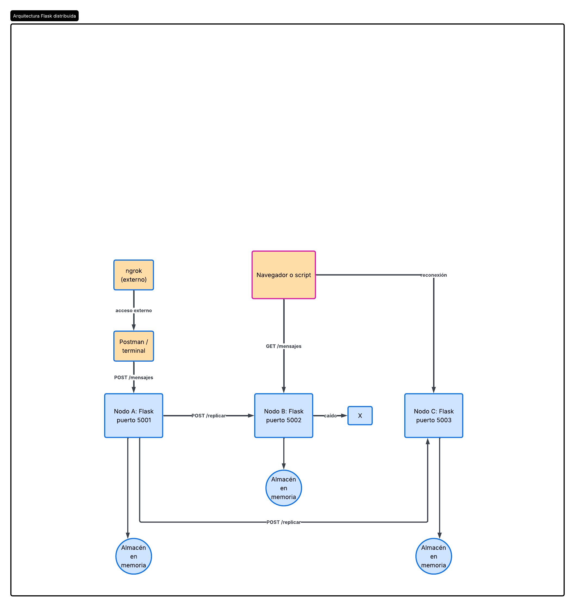
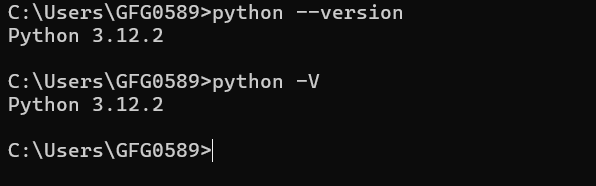

# Sistemas Distribuidos — Proyecto NodeMesh

## Descripción
Sistema de chat distribuido con varios nodos Flask que replican mensajes entre sí. El cliente puede conectarse a cualquier nodo y el sistema sigue funcionando si uno de los nodos falla.

## Integrantes
- Angelo Mendoza
- Diego Vazquez
- Guillermo Mejenes
- Diego Lopez
- Jorge Soberanes

## Tecnologías
- Python 3
- Flask
- Docker (opcional)
- GitHub
- Postman
- ngrok
- LucidChart

## Arquitectura
- **Nodos:** 3 nodos Flask en los puertos 5001, 5002 y 5003.
- **Comunicación:** HTTP/REST con JSON.
- **Cliente → Nodo:** `POST /mensajes`, `GET /mensajes`.
- **Nodo → Nodo:** `POST /replicar`.
- **Tolerancia a fallos:** si un nodo cae, los otros siguen funcionando y el cliente puede reconectarse.

## Diagrama de arquitectura

## Versión de Python

## Endpoints planeados
- `POST /mensajes` — enviar mensaje
- `GET /mensajes` — listar mensajes
- `POST /replicar` — replicar mensaje entre nodos
- `GET /health` — estado del nodo

## Cómo se probará
1. Levantar los 3 nodos.
2. Enviar mensajes desde Postman o terminal.
3. Verificar que los mensajes aparecen en otro nodo.
4. Apagar un nodo y comprobar que el chat sigue.

## Estado del avance
- [x] Repositorio creado
- [x] Arquitectura definida
- [x] Diagrama en LucidChart
- [x] Captura de versión de Python
- [ ] Implementación del primer nodo
